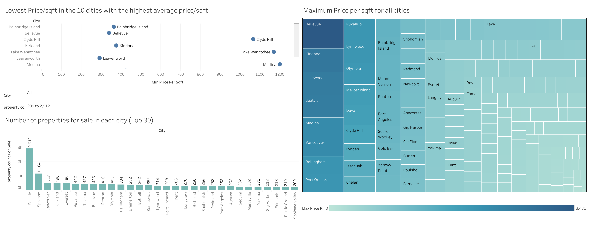

# WA-Real-Estate-Data-Analysis

## Introduction

This project aims to analyze real estate data in Washington state to provide insights into property values. I've used 
Scraping to get the Data from Realtor.com, and then cleaned and imported the data into a local SQL database using a Docker container.
Then performed some Exploratory Data Analysis to get some insights into the data. The results are also visualized using Tableau.

## Data Sources

The data for this analysis is sourced from the web scraping of Realtor.com, with the help of the HomeHarvest library linked below:

- [Real Estate Data](https://github.com/Bunsly/HomeHarvest)

Note: I changed the script to get all the zipcodes in WA state. I've added the modified script to this repo.

## Technologies and Tools
Python, SQL, Docker, Tableau

## Visualization
- [Tableau Dashboard](https://public.tableau.com/views/WAStateRealEstateAnalysisOct_2024/Dashboard1?:language=en-US&:sid=&:redirect=auth&:display_count=n&:origin=viz_share_link)

